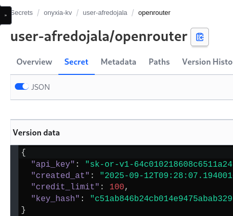
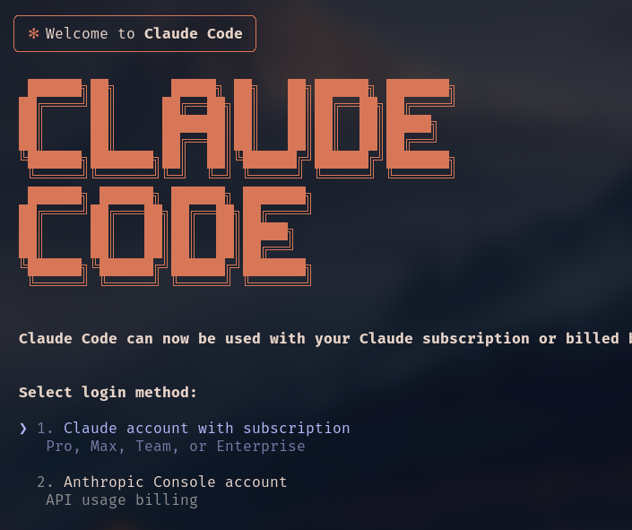
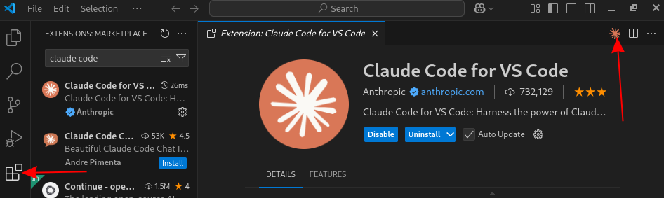

# Installationsguide: Claude Code

Inför workshopen så vill vi att Claude Code ska vara installerat på er maskin.
Här kommer en guide för hur man installerar claude code.
Slutmålet för den här guiden är claude code är installerat (med optional claude code i VSCode installerat) och en ny projektmapp skapad med claude code körandes.

Om du kommer från windows, installera först [WSL](#WSL)


Vid frågor eller problem, Kontakta Andreas Fred-Ojala


# Verifiera Node Version

Säkerställ Node/npm-version (Linux, WSL, macOS)

Claude Code kräver Node 18+. Verifiera din Node version genom:

```
node -v
npm -v
```

är Nodes version större än 18 och npm finns tillgängligt kan du hoppa över nästa steg.

## Installera Node >= 18

Installera nvm genom detta kommandot:

```
curl -o- https://raw.githubusercontent.com/nvm-sh/nvm/v0.39.7/install.sh | bash
source ~/.bashrc    # eller ~/.zshrc på macOS
nvm install --lts
nvm use --lts
```

Verifiera att node har versionen senare än 18 

```
node -v
npm -v
```

# Installera Claude Code

enklast installerar man claude code med följande:

```
npm install -g @anthropic-ai/claude-code
```

verifiera installationen med
```
  claude --version
```

## Sätt in API-nycklar

i din ~/.bashrc (eller .zshrc om du är på mac)
lägg in dessa miljövariablerna

```
export ANTHROPIC_API_KEY=<KEY>
export ANTHROPIC_CUSTOM_HEADERS="x-api-key: $ANTHROPIC_API_KEY"
export ANTHROPIC_BASE_URL="https://claude-router.platform.datadrivet.ai"
```

där `<KEY>` går att hämta från vår [vault](https://vault.platform.datadrivet.ai/ui/vault/secrets/onyxia-kv/kv/list).
Gå in på din användare (user-DITTNAMN), klicka på openrouter och välj sedan secret. Där finns ett attribut som heter "api_key"





När du har ändrat i din `~/.bashrc` (eller zshrc) starta en ny terminal

och kolla så att dina miljövariabler existerar

```
printenv | grep ANTHROPIC
```

och det ska skrivas ut de tre variablerna vi skrev in ovan.

## Bypassa Onboarding (kanske inget måste)

Vid första starten kan Claude Code visa en onboarding screen där man får välja mellan två val (Visas efter man valt färgtemat).
Om detta händer, stäng av claude code med CTRL-c CTRL-c (snabbt två gånger) och editera json-filen



```
~/.claude.json
```

och lägg till raden

```
  "hasCompletedOnboarding": true,
```

någonstans i din claude konfiguration på lägsta nivån i json-objektet, så att den ser ut såhär:

```
{
  "installMethod": "global",
  "autoUpdates": true,
  "cachedStatsigGates": {
    "tengu_disable_bypass_permissions_mode": false
  },
  "firstStartTime": "2025-09-15T10:29:37.502Z",
  "hasCompletedOnboarding": true,
  "userID": "SECRET",
  "projects": {
    "/home/afredojala/repos/help-me": {
      "allowedTools": [],
      "history": [],
      "mcpContextUris": [],
      "mcpServers": {},
      "enabledMcpjsonServers": [],
      "disabledMcpjsonServers": [],
      "hasTrustDialogAccepted": false,
      "projectOnboardingSeenCount": 0,
      "hasClaudeMdExternalIncludesApproved": false,
      "hasClaudeMdExternalIncludesWarningShown": false
    }
  }
}
```

## Skapa projekt mapp och validera Claude Code

Skapa en ny mapp i WSL/Mac/Linux på valfri plats

```
mkdir vibe-coding && cd vibe-coding
```

och starta claude code med

```
claude 
```

Lite på din API-nyckel och lita på mappen du är i (Tryck yes på båda alternativen)
när claude är igång,

kör

```
/status
```


och få ut något liknande:

```
Account
 └ Auth Token: none
 └ API Key: ANTHROPIC_API_KEY

API Configuration
 └ Anthropic Base URL: https://claude-router.platform.datadrivet.ai

Model • /model
 └ Default (claude-sonnet-4-20250514)

```

då kan du pröva att skriva "Hello" och claude svarar på något sätt


# Installera claude code i VSCode (Optional)

Om du vill köra claude code i VSCode kommer här en enkel instruktion

## Installera VSCode

Om du inte har VSCode installerat, följ instruktionerna här:

https://code.visualstudio.com/download

## Installera Claude code extension
 
För att köra claude code i din VSCode behöver du installera claude code extension i VSCode.
Om du ska göra detta ifrån windows är det viktigt att du startar VSCode från din WSL-instans

För att enklast göra detta, gå till vibe-coding mappen och kör

```
code .
```

Gå senare till extension och sök på claude code. Installera claude code och sedan kan du starta 





### Färdig installation

Nu när du har installerat allting kan du skicka en tumme upp till Andreas Fred-Ojala, så att vi vet att allting är igång för dig

# WSL

Öppna PowerShell som administratör och kör:

```
wsl --install
  
```

Starta om vid behov. Öppna Ubuntu från Start-menyn och sätt upp användare.


```
sudo apt update && sudo apt upgrade -y
sudo apt install -y git curl unzip ca-certificates
```
